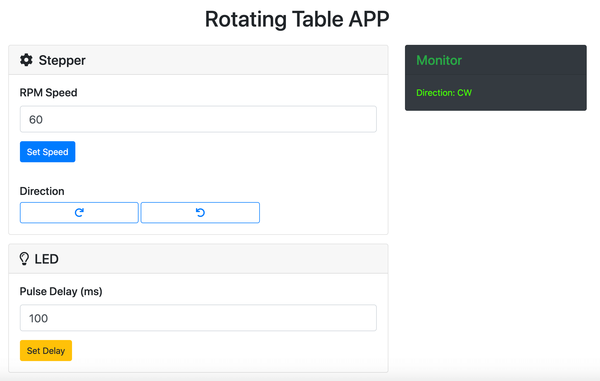
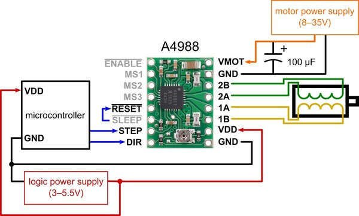
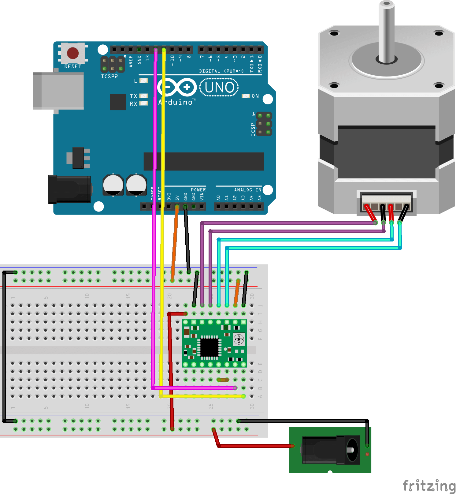
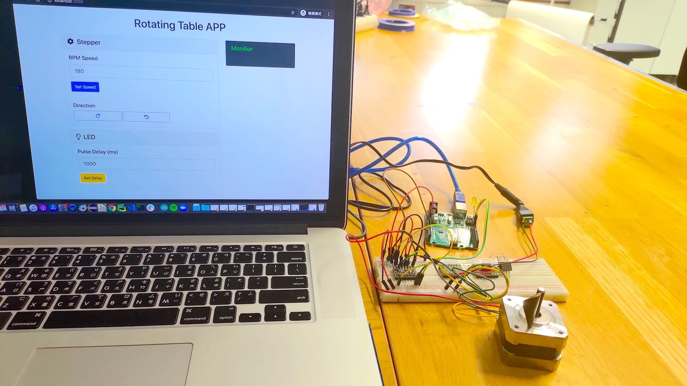

# Control Arduino Stepper via Serial Port

## Node Modules

- [johnny-five](http://johnny-five.io/)
- [express](https://expressjs.com/)
- [socket.io](https://socket.io/)
- [serve-favicon](https://github.com/expressjs/serve-favicon)

## Control Panel

### Features

- **Stepper**
  - **RPM Speed**: sets the RPM speed of the motor (ideal range: **50-3000 rpm**, depending on the motor specification/datasheet)
  - **Direction**: sets the motor to move **clockwise** or **counterclockwise**

- **LED**
  - **Pulse Delay(ms)**: sets the blinkg speed of the LED

- **Monitor**: shows the respond after the user clicks a button or types a number



### Installation

1. Install [Node.js](https://nodejs.org/en/download/)
2. Add and upload [AdvancedFirmata](https://github.com/soundanalogous/AdvancedFirmata) to Arduino ([installation](https://github.com/soundanalogous/AdvancedFirmata#to-use))
3. Open the terminal and run the below commands in order

    ``` bash
    git clone https://github.com/cv47522/nodejs-j5-arduino-stepper.git

    cd path/to/repository

    npm i  # install the required node modules automatically

    node webServer.js  # start the server
    ```

4. Type <http://localhost:3000> in a browser to go to the client-side control panel

## Hardware

- Arduino UNO *1
- Stepper Driver ([TMC2208 SilentStepStick](https://www.digikey.fi/product-detail/en/trinamic-motion-control-gmbh/TMC2208-SILENTSTEPSTICK/1460-1201-ND/6873626) or [Pololu A4988](https://www.pololu.com/product/1182)) *1
- Stepper Motor (Bipolar, or 4-wire) *1
- 8-35V Power Adapter/Supply
- [5.5mm Barrel Power Jack](https://www.sparkfun.com/products/119) *1
- Optional: [DIY Stepper Shield](https://github.com/jw4rd/stepper) *1

## Pin Connection (e.g. A4988)





## Testing Video

[](https://youtu.be/y3VsqAG2W88)
